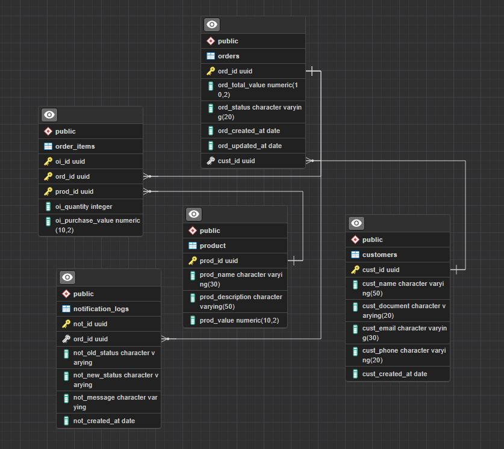

# Desafio Técnico iPag - API de Gerenciamento de Pedidos

Esse é o meu progresso em relação ao desafio técnico, aqui vou registrar e discorrer sobre minhas decisões quanto a arquitetura, modelagem, techs utilizadas, e outros aspectos pertinentes. 

O projeto consiste em uma API REST para gerenciamento de pedidos e um Worker para processamento assíncrono de notificações, utilizando Node.js, Express, PostgreSQL e RabbitMQ, tudo orquestrado com Docker.

## Seções

- Setup e Execução
- Documentação da API (Endpoints)
- Plano de Trabalho
- Decisões Técnicas
- Futuras decisões e Melhorias
- Conclusões e aprendizados

## Setup e Execução

Siga os passos abaixo para configurar e executar o projeto em seu ambiente local.

### **Pré-requisitos**

- [**Docker**](https://www.docker.com/get-started/) e [**Docker Compose**](https://docs.docker.com/compose/install/) instalados em sua máquina.
- [**Git**](https://git-scm.com/) para clonar o repositório.
- Um cliente de API, como [**Postman**](https://www.postman.com/) ou [**Insomnia**](https://insomnia.rest/), para testar os endpoints.

### **1. Clonar o Repositório**

Abra seu terminal e clone o projeto:

```bash
git clone git@github.com:vinicete/ipag-challenge.git
cd ipag-challenge
```

### 2. Variáveis de Ambiente

Ajuste as variáveis de ambiente seguindo esse exemplo:

```jsx
# Configuração Database
DB_HOST=db
DB_USER=postgres         
DB_PASSWORD=postgres123   
DB_NAME=ipag              
DB_PORT=5432

# Configuração Rabbitmq
RABBITMQ_HOST=rabbitmq 
RABBITMQ_USER=user
RABBITMQ_PASSWORD=123456
```

### 3. Subir os containers com docker-compose

```jsx
docker-compose up --build -d
```

Para pausá-los execute:

```jsx
docker-compose down
```

### 4. Tudo pronto

Se tudo executar bem você deve receber os logs em seu terminal, e ao executar:

[http://localhost:3000](http://localhost:3000/)

Você deve receber uma mensagem de boas vindas.

---

## Documentação da API (Endpoints)

Uma coleção do Postman com exemplos de requisições para todos os endpoints está disponível no arquivo `ipag-challenge.postman_collection.json` na raiz do projeto. Você pode importá-la para testar a API facilmente.

Abaixo estão detalhados os principais endpoints:

### Produtos

### Criar Produto

Cria um novo produto no catálogo.

- **Método:** `POST`
- **URL:** `/products`
- **Corpo da Requisição (Body):**
    
    ```json
    {
      "name": "Laranja",
      "description": "Fruta muito boa",
      "value": 12.5
    }
    ```
    

---

### Buscar Produto por ID

Busca um produto específico pelo seu ID.

- **Método:** `GET`
- **URL:** `/products/:id`
- **Exemplo:** `/products/b22afd69-8e7b-4499-8bbd-797f485c2cea`

---

### Clientes

### Criar Cliente

Cria um novo cliente.

- **Método:** `POST`
- **URL:** `/customers`
- **Corpo da Requisição (Body):**
    
    ```json
    {
      "name": "Enzo",
      "document": "1234567890",
      "email": "enzo@gmail.com",
      "phone": "1899977777"
    }
    
    ```
    

---

### Buscar Cliente por ID

Busca um cliente específico pelo seu ID.

- **Método:** `GET`
- **URL:** `/customers/:id`
- **Exemplo:** `/customers/bb91a617-016a-4626-878c-31ec5190711e`

---

### Pedidos

### Criar Pedido

Cria um novo pedido para um cliente existente, contendo uma lista de produtos.

- **Método:** `POST`
- **URL:** `/orders`
- **Corpo da Requisição (Body):**
    
    ```json
    {
      "cust_id": "3acee30a-0515-455e-8bcb-d38125ed428f",
      "items": [
          {
              "prod_id": "b22afd69-8e7b-4499-8bbd-797f485c2cea",
              "quantity": 2
          },
          {
              "prod_id": "910b6320-d823-49ea-8161-32656a0ebeba",
              "quantity": 1
          }
      ]
    }
    
    ```
    

---

### Buscar Pedido por ID

Busca um pedido específico pelo seu ID.

- **Método:** `GET`
- **URL:** `/orders/:id`
- **Exemplo:** `/orders/795b2c7d-b704-4883-98e0-5aeab11940be`

---

### Atualizar Status do Pedido

Atualiza o status de um pedido específico.

- **Método:** `PUT`
- **URL:** `/orders/:id/status`
- **Exemplo:** `/orders/795b2c7d-b704-4883-98e0-5aeab11940be/status`
- **Corpo da Requisição (Body):**
    
    ```json
    {
      "ord_status" : "PROCESSING",
      "notes" : "Processando"
    }
    
    ```
    

---

## Plano de Trabalho

Descrição das tasks mínimas e previsão do tempo de duração de cada uma:

| Tasks | Tempo |
| --- | --- |
| 1. Configuração Inicial |  |
| 1.1 Criação de repositório no Github e commit com estrutura inicial de pastas. | 1 hora |
| 1.2. Criação e configuração do Dockerfile e docker-compose e instalação de dependências | 2 horas |
| 1.3. Modelagem do banco de dados. | 1:30 hora |
| 1.4. Estruturação de pastas e definição de padrões de projeto. | 1 hora |
| 1.5. Configuração inicial do Express e da conexão com o banco | 1 hora |
| 2. Implementação Inicial - API |  |
| 2.1. Implementação do endpoint **POST /orders** | 3 a 4 horas |
| 2.2. Implementação do endpoint **GET /orders/{order_id}** | 3 horas |
| 2.3. Implementação do endpoint **PUT /orders/{order_id}/status** | 3 horas |
| 2.4. Integração com o RabbitMQ | 3 horas |
| 3. Worker |  |
| 3.1 Criação do Worker para conexão com o RabbitMQ | 3 horas |
| 3.2 Lógica do Worker para consumir a order_status_updates e salvar os logs | 4 horas |
| 3.3 Lógica para envio de log estruturado | 3 horas |
| 4. Finalizar Implementação |  |
| 4.1. Implementação do endpoint **GET /orders** | 2 horas |
| 4.2. Implementação do endpoint **GET /orders/summary** | 3 horas |
| 4.3. Revisões, melhorias e refatorações no código. | 2 horas |
| 4.4. Construir o README final, comentar partes necessárias do código e push final. | 3 horas |

### Observações:

Tentei ser o máximo realista possível, sendo um pouco pessimista em certas tasks que imagino que levariam maior quantidade de testes e pesquisa.

Implementei os 3 endpoints que são o **core** da aplicação primeiro e já fiz as demais integrações, deixei os outros 2 por último por serem menos cruciais, caso falte tempo ou algum imprevisto aconteça o principal estará feito.

---

## Decisões Técnicas

Pra começar eu gostaria de aprender melhor sobre algumas tecnologias e métodos que não estou tão familiariazado sendo os principais o RabbitMQ e as como gerar as migrations na stack que eu escolher.

Antes de tudo, criei o plano de trabalho requisitado e enviei por email, nele contém as tasks que vou trabalhar e a previsão do tempo de duração delas.

Abaixo vou deixar uma todolist de desenvolvimento para eu me organizar melhor e relembrar pontos mais específicos e de melhorias:

- [ ]  Retornar orderItems no getOrderById
- [ ]  Melhorar o error handling em todos os endpoints
- [ ]  Adicionar validação adicional no status do PUT
- [ ]  Refatoração para injeção de dependências
- [x]  Traduzir logs pro ingles
- [ ]  Adicionar os outros endpoints

## Primeiras Decisões

Decidi utilizar Express com Postgres somente pela familiaridade que já possuo com a stack, nada em especial. 

## Definindo o Setup

Criei o repo publico no github, criei a pasta inicial do arquivo e fiz o primeiro commit :)

Em seguida instalei as dependências do postgres e rabbitmq em conjunto com a criação do Dockerfile e docker-compose.yml.

## Modelando a DataBase



Precisei raciocinar um pouco quanto à modelagem de dados, utilizei alguns atributos da modelagem mínima sugerida porém decidi adicionar a tabela de “products” com um relacionamento de muitos pra muitos, dessa forma o modelo ficou muito mais sólido, tendo os pedidos a referencia exata de cada produto, e cada produto com seus atributos registrados. 

Optei por utilizar também uuids para garantir maior segurança e unicidade.

Fiz a primeira migration, configurei a database e pronto. 

## Desenvolvimento

Para começar, pensei na estrutura de pastas e segui um mvc destrinchando a camada de model em repositories e services para melhor separação de responsabilidades, como não é um projeto grande creio que será o suficiente.

Comecei a desenvolver o endpoint de customers e nesse momento decidi utilizar uma biblioteca para ajudar na validação dos dados, então instalei o zod que ja faz diversas modificações automaticamente.

Implementei somente os endpoints necessários para o gerenciamento do pedido posteriormente devido ao tempo curto.

### POST/orders

O payload sugerido do POST/orders se referia a uma modelagem mais simplificada, como eu modelei a tabela de forma mais estruturada passei os ids como referencia para garantir integridade e consistencia. 

### GET/orders/{order_id}

Foi tranquilo trazer somente as informações da order, poderia trazer os order items vinculados ao seu id por agora mas devido ao tempo vou postergar 

### **PUT /orders/{id}/status**

Chegou a hora de implementar as regras de negócio e o fluxo da aplicação de fato. Para gerenciar os status eu pensei inicialmente em utilizar um switch e fazer comparações, mas pensei melhor e se os status fossem numéricos seria muito mais fácil de aplicar as regras de negócio, portanto criei um objeto estático (como um enum) para que representasse todos os status possíveis e fazer comparações relacionais

## Implementação do RabbitMQ

Sendo bem sincero eu nunca tinha desenvolvido com rabbitmq, eu sabia os conceitos e o que ele fazia pois na minha experiência de estágio utilizamos uma arquitetura monolitica modular em camadas em que é necessário a utilização dele, mas não sabia nada sobre desenvolver com ele. Pesquisei muito e aprendi melhor e como configurá-lo.

Nesse momento durante os testes eu percebi que talvez a abordagem que eu tomei deixando os métodos das classes estáticos não tenha sido a melhor nesse caso. Funciona em apps mais simples os quais eu já tive experiência prévia, porém a injeção de dependência se torna fundamental nesse caso pois estou usando uma única instância do rabbitmq no server todo, injetá-la na “camada” de serviço seria a solução mais robusta mesmo.

O método que tinha feito até então visava ser pragmático e prático, porém errei na questão da escalabilidade e melhores práticas.

Pra conseguir contornar isso e utilizar a instância do rabbit ou eu instancio o rabbitserver em cada requisição na camada de service ou então eu faço uma espécie de “prop drilling”, passando a instância por parametros até a camada. Vou seguir com a segunda opção pois é mais performática, porém o ideal seria fazer essa refatoração.

### Desafios

Foi bem complicado configurar e na primeira instância não consegui fazer com que a mensagem fosse enviada, portanto como meu tempo está acabando decidi fazer uma refatoração básica para melhorar a qualidade do software.

## Futuras decisões e Melhorias

Até o momento de entrega do software o serviço de mensageria não estava funcionando corretamente, minhas futuras decisões seriam implementá-lo corretamente, fazer a refatoração correta para conseguir injetar as dependências e construir o Worker para consumir as mensagens da fila.

Após essas funcionalidades principais eu faria os outros endpoints e aplicaria uma revisão geral, melhorando as validações, deixar a regra de negócio mais robusta, melhorando o tratamento de erro e logs.

## Conclusões e aprendizados 🙏

É com incrível felicidade que eu concluo esse desafio, realmente me deixou instigado do momento que eu recebi até agora, pude colocar em prática conhecimentos que eu já tinha e ainda aprender muito mais, principalmente sobre mensageria com o RabbitmMQ, containers e padrões de projeto.

Em aproximadamente 5 dias de desenvolvimento, fazendo estágio e indo pra faculdade infelizmente não consegui entregar todas as funcionalidades, mas pude fazer com que os principais endpoints funcionassem com certa qualidade e setei uma configuração inicial para o rabbit.

Não sei com vocês lidam quanto a isso, mas por ser um teste técnico tentei me basear mais na documentação e tutoriais mesmo, utilizei IA apenas de forma muito consciente e como ferramenta de pesquisa rápida.

No mais é isso, quero muito seguir em frente com a vaga por isso dei meu máximo nesse desafio, espero entrar em contato com vocês em breve, muito obrigado!

Meu currículo está anexado mas segue meus contatos:

https://www.linkedin.com/in/viniciusaraujomessias/

https://github.com/vinicete